# CoWork App DevOps

Application collaborative temps reel construite en architecture microservices, avec un objectif pedagogique DevOps complet : developpement, tests, qualite, conteneurisation, CI/CD, Kubernetes, GitOps, monitoring, alerting et securite.

Ce projet sert de fil rouge pour apprendre comment une application passe du code source a une plateforme de deploiement observable et securisee.

## Apercu

| Element | Description |
|---|---|
| Type de projet | CoWork App microservices |
| Frontend | React, Vite |
| Backend | Node.js, Express |
| Temps reel | Socket.io |
| Base de donnees | PostgreSQL |
| Cache / sessions | Redis |
| Messaging interne | RabbitMQ |
| API Gateway | Nginx |
| Conteneurisation | Docker, Docker Compose |
| Orchestration | Kubernetes, Minikube |
| Packaging | Helm |
| CI/CD | Jenkins, GitHub Actions |
| Registry | Docker Hub |
| GitOps | Argo CD |
| Qualite | ESLint, Jest, Supertest, SonarCloud |
| Observabilite | Prometheus, Grafana, Loki, Sentry |
| Alerting | AlertManager vers Discord |
| Securite | Secrets K8s, Network Policies, securityContext, RBAC, Trivy, Dependabot |

## Fonctionnalites

- Inscription, connexion, deconnexion et refresh token.
- Authentification JWT avec verification inter-services.
- Gestion de profil utilisateur.
- Workspace de collaboration avec chat temps reel Socket.io.
- Historique des messages par room.
- Front React avec pages Login, Register, Chat et Profile sous le branding CoWork App.
- Interface chat enrichie : rooms, recherche, directory, fichiers partages, presence et typing indicator.
- Reverse proxy Nginx pour centraliser les routes API et WebSocket.
- Tests unitaires et tests d'integration sur les services backend.
- Pipeline Jenkins pour lint, tests, analyse SonarCloud, build Docker, scan Trivy et push Docker Hub.
- Deploiement Kubernetes local avec Minikube.
- Charts Helm pour les services applicatifs.
- GitOps avec Argo CD.
- Monitoring Prometheus, dashboards Grafana, logs Loki et erreurs Sentry.
- Alertes Prometheus/AlertManager envoyees vers Discord.
- Durcissement securite Kubernetes.

## Architecture

```text
Utilisateur
   |
   v
Front React
   |
   v
Nginx API Gateway
   |
   +--> Auth service -------> PostgreSQL
   |        |                    ^
   |        +--> Redis           |
   |
   +--> Profiles service ----> PostgreSQL
   |
   +--> Messaging service ---> PostgreSQL
            |
            +--> Redis
            +--> RabbitMQ
            +--> Socket.io
```

Flux DevOps global :

```text
GitHub
  |
  v
Jenkins
  |
  +--> Lint + tests + coverage
  +--> SonarCloud
  +--> Docker build
  +--> Trivy scan
  +--> Docker Hub
  |
  v
Helm values / Git
  |
  v
Argo CD
  |
  v
Kubernetes / Minikube
  |
  +--> Prometheus + Grafana
  +--> Loki + Promtail
  +--> Sentry
  +--> AlertManager + Discord
```

## Services

| Service | Port | Role |
|---|---:|---|
| `auth` | 3001 | Register, login, logout, refresh token, verification JWT |
| `profiles` | 3002 | Lecture et mise a jour des profils utilisateurs |
| `messaging` | 3003 | Chat temps reel, rooms, historique des messages |
| `front` | 80 | Interface React servie par Nginx |
| `nginx` | 80 | Reverse proxy et API Gateway |

Routes principales via Nginx :

| Route | Destination |
|---|---|
| `/` | Front React |
| `/api/auth/*` | Service `auth` |
| `/api/profiles/*` | Service `profiles` |
| `/api/messages/*` | Service `messaging` |
| `/socket.io/*` | WebSocket Socket.io du service `messaging` |

## Structure du projet

```text
.
├── front/                    # Application React/Vite
├── services/
│   ├── auth/                 # Service authentification
│   ├── profiles/             # Service profils
│   └── messaging/            # Service chat temps reel
├── nginx/                    # Configuration API Gateway
├── scripts/                  # Script SQL d'initialisation
├── k8s/base/                 # Manifests Kubernetes
├── helm/                     # Charts Helm applicatifs
├── jenkins/                  # Jenkins Docker local
├── docs/                     # Documentation par phase
├── repport/                  # Rapports detailles par phase
├── docker-compose.yml        # Environnement local complet
├── Jenkinsfile               # Pipeline CI/CD
├── monitoring-values.yaml    # Configuration monitoring
├── loki-stack-values.yaml    # Configuration Loki/Promtail
├── CONTEXT.md                # Contexte global du projet
└── PROGRESS.md               # Suivi des phases
```

## Prerequis

- Git
- Docker et Docker Compose
- Node.js 20 ou plus
- npm
- kubectl
- Minikube
- Helm
- Argo CD CLI optionnel

Pour un premier lancement, Docker Compose suffit.

## Demarrage rapide avec Docker Compose

1. Cloner le projet.

```bash
git clone <url-du-repo>
cd chat-app-DevOps
```

2. Construire et demarrer tous les conteneurs.

```bash
docker compose up -d --build
```

3. Initialiser la base de donnees au premier lancement.

```bash
docker compose exec -T postgres psql -U user -d chat_db < scripts/init-db.sql
```

4. Ouvrir l'application.

```text
http://localhost
```

5. Verifier les conteneurs.

```bash
docker compose ps
```

6. Voir les logs.

```bash
docker compose logs -f auth
docker compose logs -f profiles
docker compose logs -f messaging
docker compose logs -f nginx
```

7. Arreter l'environnement.

```bash
docker compose down
```

Pour repartir avec une base vide :

```bash
docker compose down -v
docker compose up -d --build
docker compose exec -T postgres psql -U user -d chat_db < scripts/init-db.sql
```

Bonne pratique : ne pas utiliser les secrets de `docker-compose.yml` en production. Ils servent uniquement au developpement local.

## Demarrage manuel en developpement

Demarrer seulement les dependances :

```bash
docker compose up -d postgres redis rabbitmq
docker compose exec -T postgres psql -U user -d chat_db < scripts/init-db.sql
```

Installer et lancer les services dans des terminaux separes :

```bash
cd services/auth
npm ci
npm run dev
```

```bash
cd services/profiles
npm ci
npm run dev
```

```bash
cd services/messaging
npm ci
npm run dev
```

```bash
cd front
npm ci
npm run dev
```

Variables d'environnement utiles :

| Service | Variables principales |
|---|---|
| `auth` | `PORT`, `DATABASE_URL`, `REDIS_URL`, `JWT_SECRET`, `JWT_REFRESH_SECRET` |
| `profiles` | `PORT`, `DATABASE_URL`, `AUTH_SERVICE_URL` |
| `messaging` | `PORT`, `DATABASE_URL`, `REDIS_URL`, `RABBITMQ_URL`, `AUTH_SERVICE_URL` |
| `front` | `VITE_AUTH_URL`, `VITE_PROFILES_URL`, `VITE_SOCKET_URL`, `VITE_API_URL` |

## Tests et qualite

Lancer les tests backend :

```bash
cd services/auth
npm run test:coverage

cd ../profiles
npm run test:coverage

cd ../messaging
npm run test:coverage
```

Lancer le lint :

```bash
cd services/auth && npm run lint
cd ../profiles && npm run lint
cd ../messaging && npm run lint
cd ../../front && npm run lint
```

Le projet utilise :

- Jest pour les tests unitaires et d'integration.
- Supertest pour tester les APIs Express.
- ESLint pour la qualite du code.
- SonarCloud pour l'analyse continue.
- Dependabot pour les mises a jour de dependances.

## Deploiement Kubernetes avec Minikube

1. Demarrer Minikube.

```bash
minikube start --driver=docker --cpus=4 --memory=6g
minikube addons enable ingress
minikube addons enable metrics-server
```

2. Construire les images dans Minikube.

```bash
minikube image build -t badrkhafif98/chat-auth:latest ./services/auth
minikube image build -t badrkhafif98/chat-profiles:latest ./services/profiles
minikube image build -t badrkhafif98/chat-messaging:latest ./services/messaging
docker build -t badrkhafif98/chat-front:latest \
  --build-arg VITE_AUTH_URL=http://chat-app.local/api \
  --build-arg VITE_PROFILES_URL=http://chat-app.local/api \
  --build-arg VITE_SOCKET_URL=http://chat-app.local \
  --build-arg VITE_API_URL=http://chat-app.local/api \
  ./front
minikube image load badrkhafif98/chat-front:latest
```

3. Appliquer les manifests.

```bash
kubectl apply -k k8s/base/
```

4. Initialiser PostgreSQL dans le cluster.

```bash
kubectl exec -n chat-app -i postgres-0 -- psql -U user -d chat_db < scripts/init-db.sql
```

5. Exposer l'application.

Dans un terminal separe :

```bash
minikube tunnel
```

Ajouter le host local :

```bash
sudo sed -i '' '/chat-app.local/d' /etc/hosts
echo "127.0.0.1 chat-app.local" | sudo tee -a /etc/hosts
```

6. Ouvrir l'application.

```text
http://chat-app.local
```

Commandes utiles :

```bash
kubectl get pods -n chat-app
kubectl get svc -n chat-app
kubectl get ingress -n chat-app
kubectl logs -f deployment/auth -n chat-app
kubectl get events -n chat-app --sort-by='.lastTimestamp'
```

## Deploiement avec Helm

Les charts Helm sont dans `helm/` pour les services applicatifs :

- `helm/auth`
- `helm/profiles`
- `helm/messaging`
- `helm/front`

Verifier les charts :

```bash
helm lint helm/auth helm/profiles helm/messaging helm/front
```

Installer ou mettre a jour :

```bash
helm upgrade --install auth helm/auth -n chat-app --create-namespace \
  --set secrets.JWT_SECRET=dev_secret \
  --set secrets.JWT_REFRESH_SECRET=dev_refresh_secret

helm upgrade --install profiles helm/profiles -n chat-app
helm upgrade --install messaging helm/messaging -n chat-app
helm upgrade --install front helm/front -n chat-app
```

Helm permet de modifier les tags d'images via `values.yaml`, ce qui facilite le lien entre Jenkins et Argo CD.

## CI/CD Jenkins

Le fichier `Jenkinsfile` automatise :

1. Checkout du repo.
2. Detection des services modifies.
3. Installation des dependances.
4. Lint.
5. Tests et coverage.
6. Analyse SonarCloud.
7. Build des images Docker.
8. Scan Trivy des images.
9. Push vers Docker Hub.

Jenkins local est defini dans :

```text
jenkins/Dockerfile
jenkins/docker-compose.jenkins.yml
```

Credentials attendus dans Jenkins :

| Credential | Usage |
|---|---|
| `SONAR_TOKEN` | Analyse SonarCloud |
| `dockerhub-credentials` | Push des images Docker |

### Flux Jenkins CI/CD

Ce diagramme montre comment Jenkins transforme un push GitHub en image Docker valide, puis en mise a jour deployable par Argo CD.

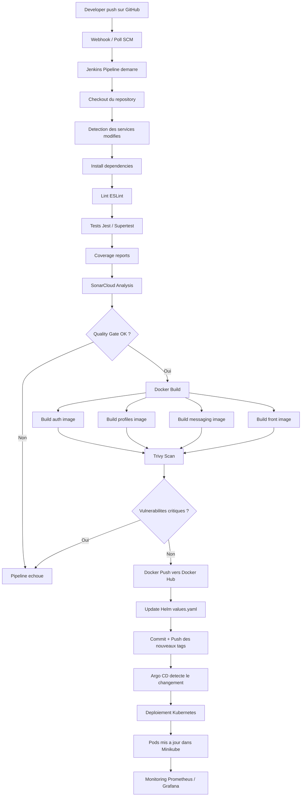

## GitOps avec Argo CD

Argo CD surveille le repo Git et synchronise les charts Helm vers Kubernetes.

Flux attendu :

```text
Push GitHub
  -> Jenkins build/test/scan/push
  -> mise a jour du tag image dans Helm
  -> commit Git
  -> Argo CD detecte le changement
  -> deploiement automatique sur Kubernetes
```

Commandes utiles :

```bash
kubectl create namespace argocd
kubectl apply -n argocd -f https://raw.githubusercontent.com/argoproj/argo-cd/stable/manifests/install.yaml
kubectl port-forward svc/argocd-server -n argocd 8090:443
```

Interface :

```text
https://localhost:8090
```

## Monitoring, logs et erreurs

La stack d'observabilite contient :

| Outil | Role |
|---|---|
| Prometheus | Collecte des metriques |
| Grafana | Dashboards |
| Loki | Stockage des logs |
| Promtail | Collecte des logs des pods |
| Sentry | Tracking des erreurs backend et frontend |

Installation Prometheus/Grafana :

```bash
helm repo add prometheus-community https://prometheus-community.github.io/helm-charts
helm repo update
helm install monitoring prometheus-community/kube-prometheus-stack \
  -n monitoring --create-namespace \
  -f monitoring-values.yaml
```

Acces Grafana :

```bash
kubectl port-forward svc/monitoring-grafana -n monitoring 3030:80
```

```text
http://localhost:3030
```

Installation Loki/Promtail :

```bash
helm repo add grafana https://grafana.github.io/helm-charts
helm repo update
helm install loki grafana/loki-stack \
  -n monitoring \
  -f loki-stack-values.yaml
```

Exemples LogQL :

```logql
{namespace="chat-app"}
{namespace="chat-app", app="auth"}
{namespace="chat-app"} |= "ERROR"
```

## Alerting

AlertManager envoie les alertes critiques vers Discord.

Elements configures :

- `k8s/base/monitoring/alert-rules.yaml`
- `k8s/base/monitoring/alertmanager-config.yaml`
- Secret Kubernetes contenant le webhook Discord.

Tester une alerte :

```bash
kubectl scale deployment auth --replicas=0 -n chat-app
kubectl port-forward svc/monitoring-alertmanager -n monitoring 9093:9093
```

Remettre le service :

```bash
kubectl scale deployment auth --replicas=1 -n chat-app
```

## Securite

Mesures deja mises en place :

- Aucun fichier `.env` suivi par Git.
- Secrets sensibles retires des ConfigMaps.
- Secrets Kubernetes pour les valeurs sensibles.
- Network Policies avec strategie `default-deny`.
- Autorisations reseau explicites entre services.
- `securityContext` durci sur les services Node.js.
- RBAC minimal pour Jenkins.
- Scan Trivy dans Jenkins avec blocage sur vulnerabilites critiques.
- CronJob Trivy planifie dans Kubernetes.
- Dependabot active sur les packages npm.

Bonne pratique : en production, les secrets doivent venir d'un vrai gestionnaire de secrets ou d'un systeme de credentials controle, pas de valeurs codees dans les manifests.

## Progression du projet

| Phase | Sujet | Statut |
|---:|---|---|
| 1 | Setup monorepo | Termine |
| 2 | Developpement des services | Termine |
| 3 | Dockerisation | Termine |
| 4 | Tests Jest + Supertest | Termine |
| 5 | Qualite SonarCloud | Termine |
| 6 | Pipeline Jenkins | Termine |
| 7 | Kubernetes Minikube | Termine |
| 8 | Helm | Termine |
| 9 | Argo CD GitOps | Termine |
| 10 | Monitoring Prometheus, Grafana, Loki, Sentry | Termine |
| 11 | Alerting AlertManager + Discord | Termine |
| 12 | Securite Kubernetes | Termine |
| 13 | Multi-environnements dev/staging/prod | En cours |

## Screenshots

### CoWork App - interface principale

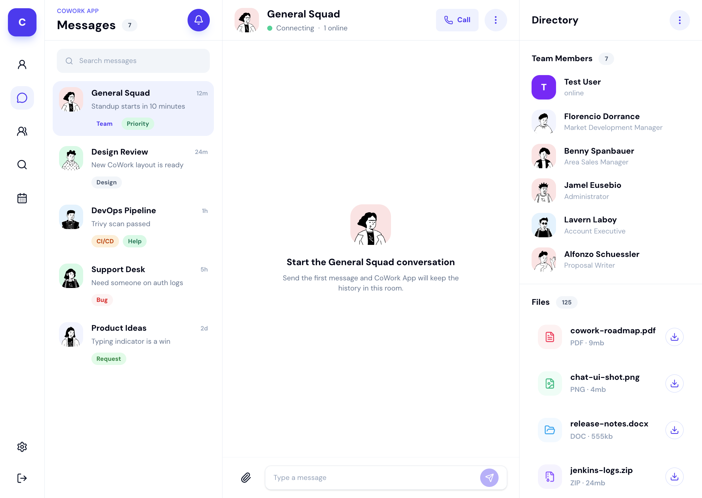

### CoWork App - connexion

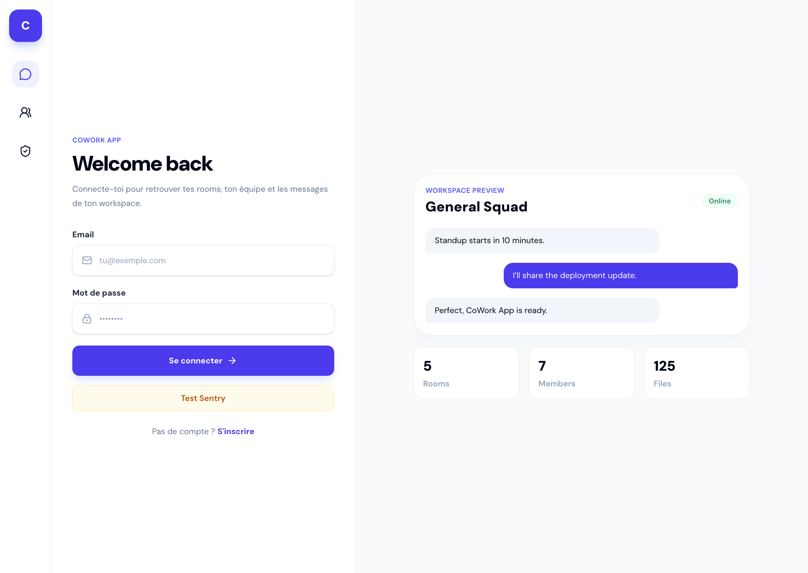

### CoWork App - inscription

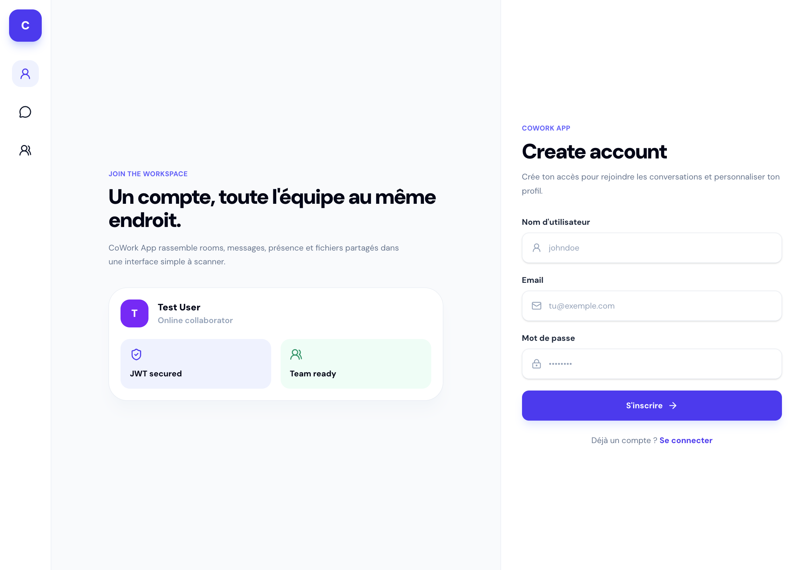

### CoWork App - settings profil

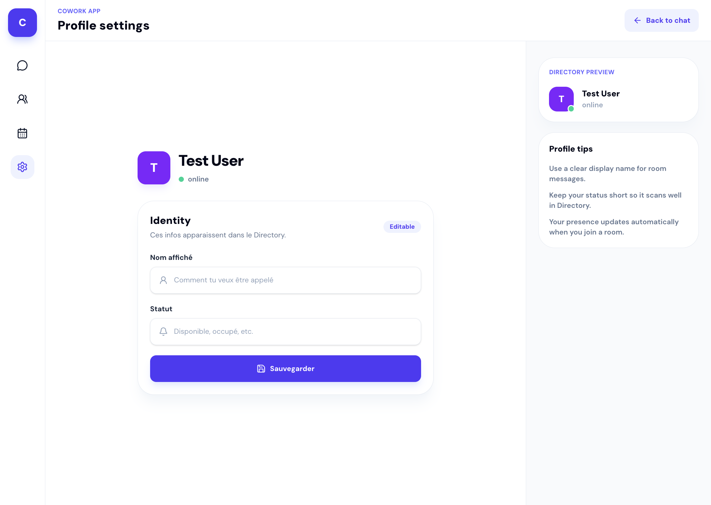

### Docker - conteneurs locaux

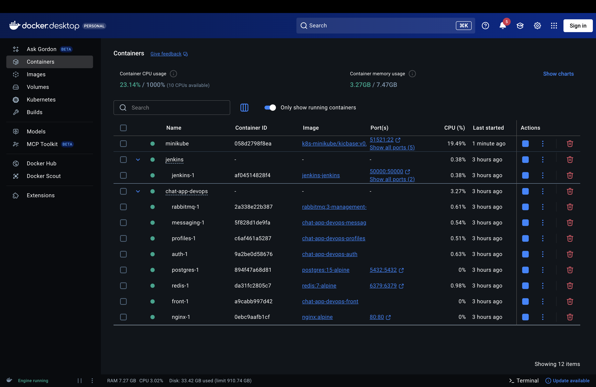

### Jenkins - pipeline CI/CD

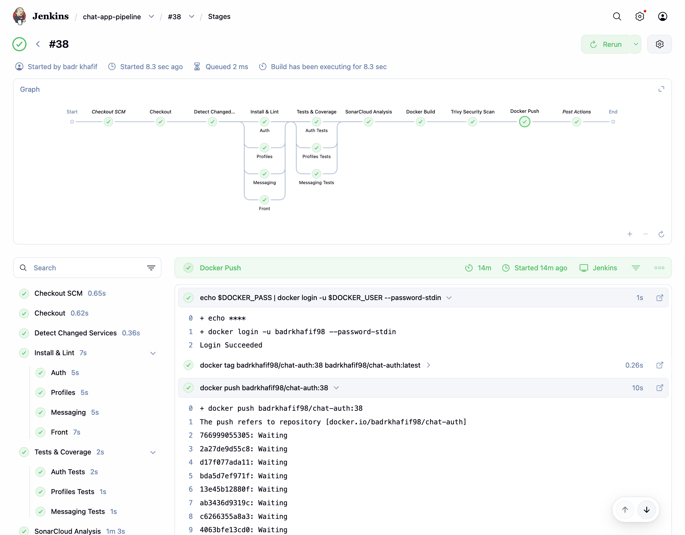

### SonarCloud - qualite du code

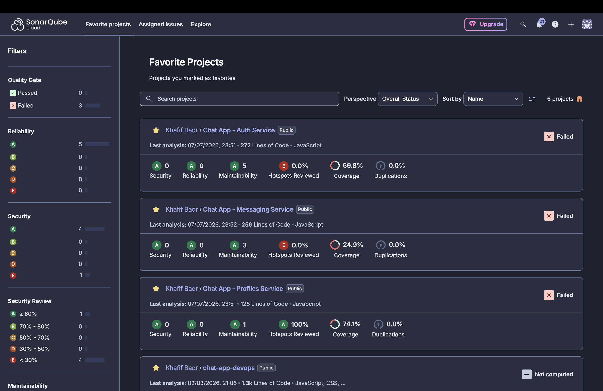

### Kubernetes - pods Minikube

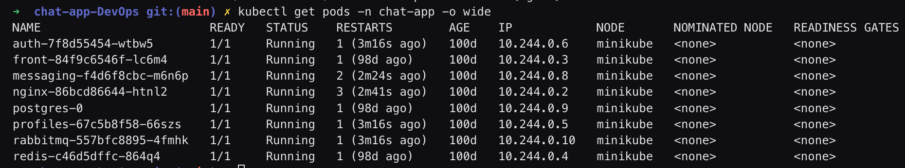

### Kubernetes - dashboard

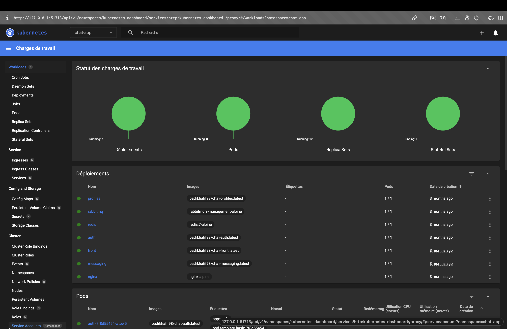

### Argo CD - synchronisation GitOps

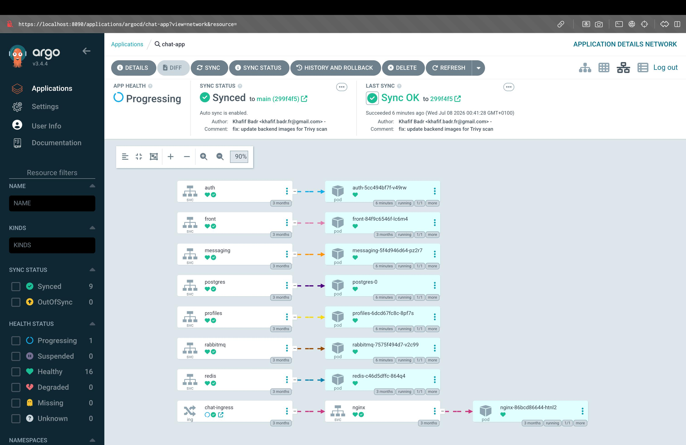

### Grafana - dashboard observabilite

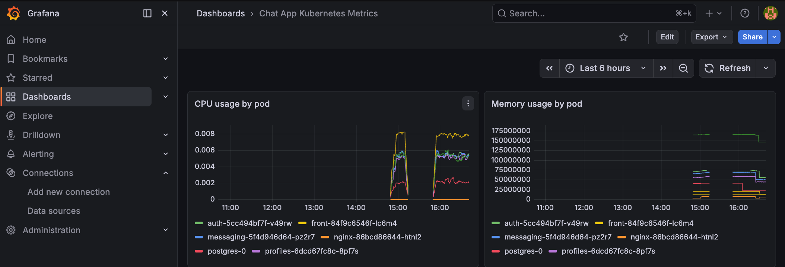

### Prometheus - requete memoire

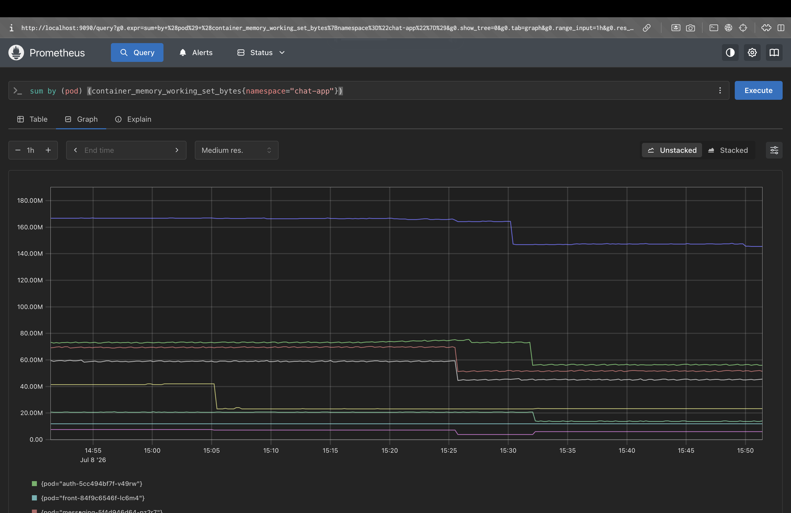

### Prometheus - requete CPU

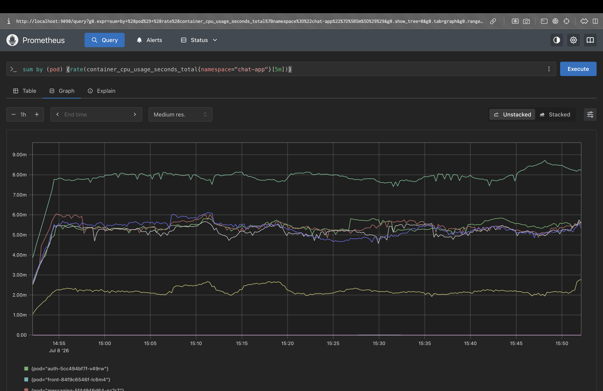

### Loki - logs applicatifs

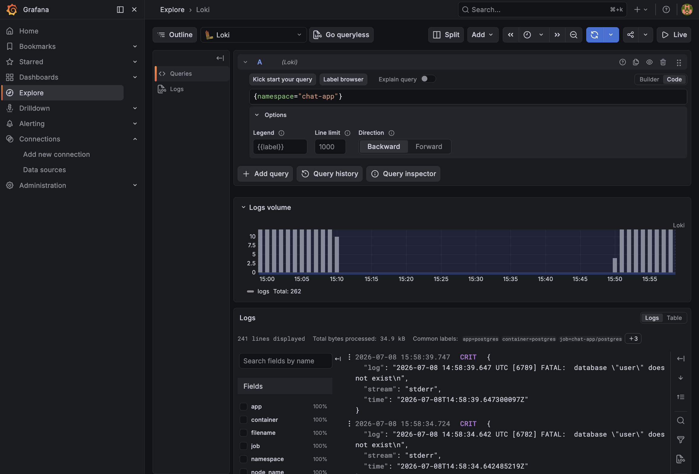

## Screenshots a ajouter

Les captures UI principales, Docker, Jenkins, SonarCloud, Kubernetes, Argo CD, Grafana, Prometheus et Loki sont deja ajoutees dans `docs/assets/screenshots/`. Les captures DevOps restantes peuvent etre ajoutees avec ces noms :

| Nom du fichier | Contenu attendu |
|---|---|
| `13-sentry-error.png` | Erreur capturee dans Sentry |
| `14-alertmanager-discord.png` | Notification Discord envoyee par AlertManager |
| `15-trivy-scan.png` | Resultat du scan Trivy |

## Documentation complementaire

- `CONTEXT.md` : architecture et vision globale.
- `PROGRESS.md` : avancement detaille.
- `docs/Phase1.md` a `docs/Phase17.md` : guide pedagogique par phase.
- `repport/phase*.md` : rapports de validation par phase.

## Notes pedagogiques

Ce projet n'est pas seulement une application de chat. Il montre surtout comment les briques DevOps s'enchainent :

- Docker rend l'environnement reproductible.
- Kubernetes orchestre les services.
- Helm rend les deploiements parametrables.
- Jenkins automatise la verification et la livraison.
- Argo CD applique l'etat desire depuis Git.
- Prometheus, Grafana, Loki et Sentry rendent le systeme observable.
- Trivy, Network Policies, Secrets et RBAC reduisent les risques.

La question a toujours garder en tete : si une personne rejoint le projet demain, peut-elle comprendre, lancer, verifier et depanner l'application avec ce repo ?
